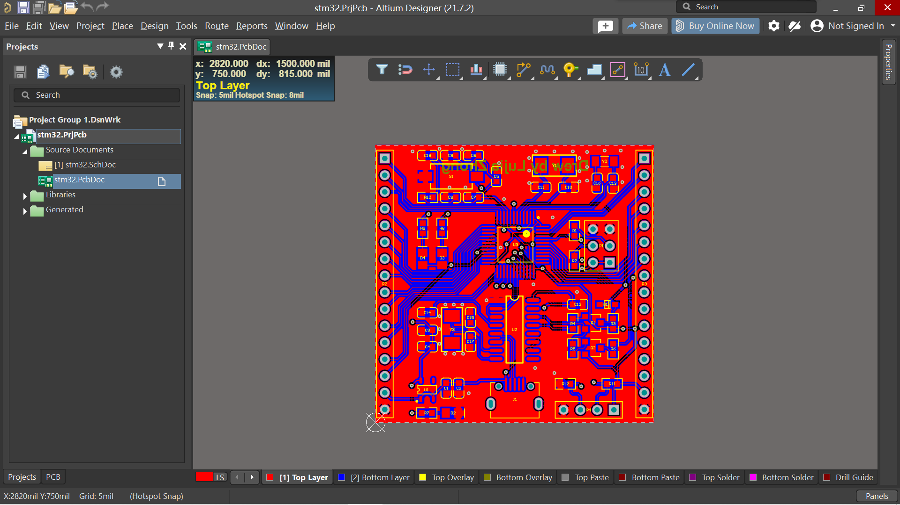
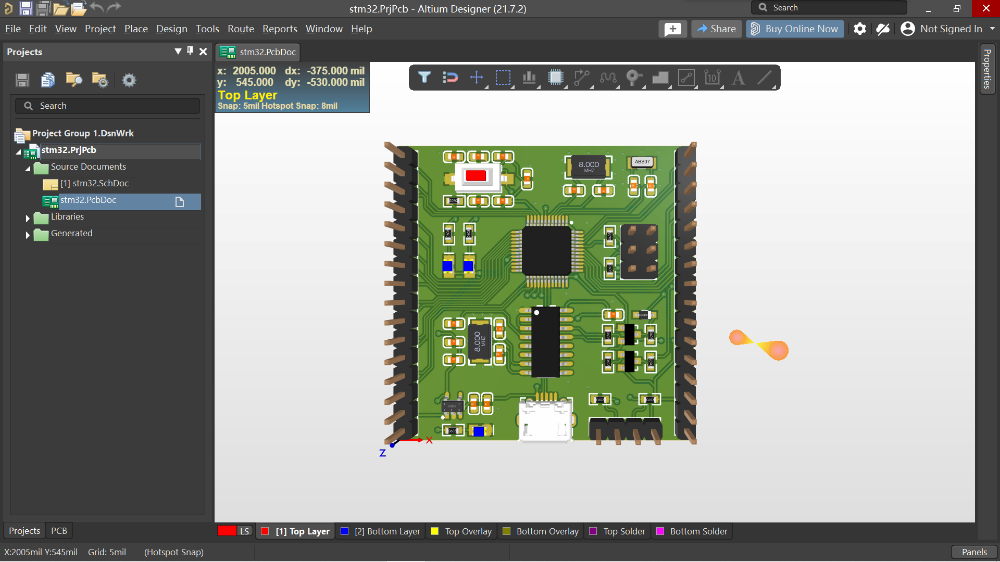

A stm32 PCB drew by myself, from schematic document to PCB layout, routing, copper pour, and validation. 

It's the first time I went through the whole process of PCB Design and I found it quite amazing.

|
2D
|
3D
|
|---|---|
|||
