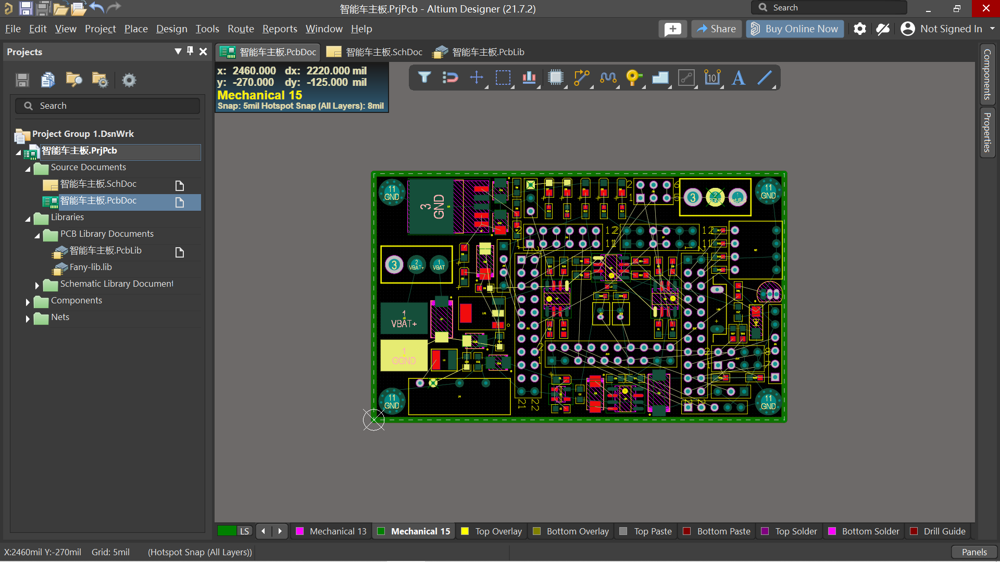

This is first time following the video instruction to draw the PCB of a smart robot car.

But because of lacking basic knowledge about PCB development, I only finish the PCB Layout, where I spent much time to make it look nice but without considering about routing after that. So it only looks nice but useless because it's impossible to do routing on this compact layout.

|
2D
|
3D
|
|---|---|
|||
